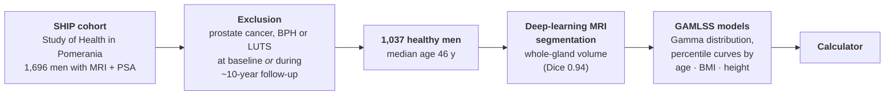
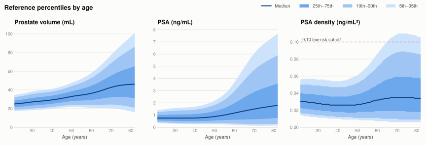
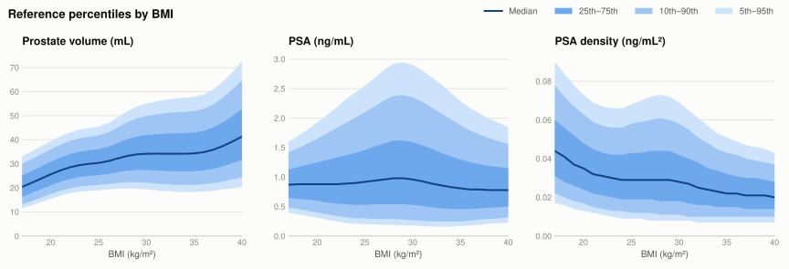

# Prostate Reference Percentiles

**Age-, BMI- and height-adjusted reference values for PSA, PSA density and MRI prostate volume in healthy men.**

[](https://prostateassistant.github.io/)
[](https://doi.org/10.1007/s00330-026-12937-2)
[](https://link.springer.com/article/10.1007/s00330-026-12937-2)

This repository hosts the open-access web calculator that accompanies:

> Lindholz M, Schoots IG, Bülow R, Asbach P, Kölln M, Nolte S, Alaro S, Ruppel R, Hosten N, Penzkofer T, Hamm CA.
> **Reference values for PSA, PSA density, and MRI prostate volume in healthy German men.**
> *European Radiology* (2026). https://doi.org/10.1007/s00330-026-12937-2

Enter age, height, weight/BMI, PSA and prostate volume and the calculator shows where each value falls
within the healthy reference population, alongside the median and 5th–95th percentile range.

---

## The study in brief

Fixed cut-offs such as "prostate volume > 30 mL" or "PSA > 3 ng/mL" ignore how much these markers vary
with age and body habitus. Most published prostate-volume norms come from transrectal ultrasound in
symptomatic or preselected patients. This study provides **population-based, MRI-derived** reference
values from men who stayed free of prostate disease for about 10 years.



- **Cohort:** Study of Health in Pomerania (SHIP-START and SHIP-TREND), a prospective population-based cohort from Northeast Germany.
- **"Healthy" definition:** men with prostate cancer, benign prostatic hyperplasia (BPH) or lower urinary tract symptoms (LUTS) were excluded at baseline *and* if the condition appeared during follow-up (median 9.8 years). This also rules out volumes altered by drugs such as finasteride or by procedures.
- **Imaging:** 1.5 T pelvic MRI. Prostate volume comes from automated whole-gland segmentation, computed as a mesh volume (PyRadiomics, IBSI-compliant).
- **Modelling:** Generalized Additive Models for Location, Scale and Shape (GAMLSS). These are the same family of models the WHO uses for its child growth standards. They capture non-linear trends and changing spread, not just a shifting mean.

## Key numbers

Overall distribution in 1,037 men:

| Parameter | 5th | 25th | **Median** | 75th | **95th** |
|---|---:|---:|---:|---:|---:|
| Prostate volume (mL) | 20.74 | 26.24 | **31.29** | 37.42 | **51.39** |
| PSA (ng/mL) | 0.32 | 0.54 | **0.81** | 1.20 | **2.79** |
| PSA density (ng/mL²) | 0.011 | 0.018 | **0.025** | 0.037 | **0.071** |

## Percentile curves

<picture>
  <source media="(prefers-color-scheme: dark)" srcset=".github/assets/percentiles-age-dark.svg">
  
</picture>

**By age**
- **Prostate volume** rises steadily, with a median of 27 mL at 30 and 46 mL at 80. The upper percentiles spread out a lot in older men.
- **PSA** rises continuously, with a median of 0.75 ng/mL at 30 and 1.75 ng/mL at 80. Its 95th percentile passes the 3 ng/mL guideline threshold at about age 57.
- **PSA density** stays remarkably stable. The age-adjusted 95th percentile **never exceeds 0.11 ng/mL²**. It peaks at ages 71–75 and declines after that. This supports the widely used **PSAD < 0.10 ng/mL²** threshold for low clinically significant cancer risk.

<picture>
  <source media="(prefers-color-scheme: dark)" srcset=".github/assets/percentiles-bmi-dark.svg">
  
</picture>

**By BMI**
- **Prostate volume** increases with BMI, with a median of 25.7 mL at BMI 20 and 41.3 mL at BMI 40.
- **PSA density** decreases with BMI (0.035 → 0.020 ng/mL²), because the same PSA is spread over a larger gland.
- **PSA** is not meaningfully related to BMI; BMI did not improve the model fit (p = 0.82).
- **Height** has a small inverse effect on PSA and a variable effect on PSA density. The calculator shows height-adjusted percentiles too.

### Selected reference values (paper, Table 1)

| | Prostate volume (mL) | | PSA (ng/mL) | | PSAD (ng/mL²) | |
|---|---:|---:|---:|---:|---:|---:|
| **Age** | median | 95th | median | 95th | median | 95th |
| 30 y | 27.11 | 38.22 | 0.75 | 1.57 | 0.028 | 0.056 |
| 40 y | 29.29 | 41.14 | 0.76 | 1.68 | 0.026 | 0.054 |
| 50 y | 32.99 | 47.54 | 0.88 | 2.17 | 0.027 | 0.061 |
| 60 y | 36.36 | 58.14 | 1.16 | 3.66 | 0.032 | 0.086 |
| 70 y | 42.70 | 77.46 | 1.49 | 6.03 | 0.035 | 0.109 |
| 80 y | 45.95 | 97.06 | 1.75 | 7.44 | 0.034 | 0.107 |

The full lookup tables are in [`data/`](data/) (Supplementary Tables 1–3 of the paper).

## Measuring volume without segmentation

The team also measured 50 random glands by hand and compared the result with the segmentation volumes:

| Method | Formula | Mean difference vs. segmentation |
|---|---|---:|
| **Bullet** | L × W × H × 5π/24 | **−0.71 mL** (good agreement) |
| Ellipsoid | L × W × H × π/6 | −6.78 mL (underestimates, and the gap grows with gland size) |

If you only have calipers, the **bullet formula** gives the volumes that best match these reference values.
All 50 test glands were under 55 mL.

## Using the calculator

1. Enter **age**, **height** and **weight** (BMI is filled in automatically) or type BMI directly.
2. Add a measured **PSA** and **MRI prostate volume**. PSA density is calculated for you.
3. Each parameter is shown against the age-, BMI- and height-specific percentiles and against a **combined model** (age + BMI + height). A value above the 95th percentile is flagged.

**Example from the paper:** a 55-year-old, BMI 27, 175 cm, PV 27 mL, PSA 2.5 ng/mL.
The volume is below the median on every reference, but the PSA density of 0.093 ng/mL² is **above the 95th percentile** on all of them.

## Limitations

- The cohort is Northern German only, so the values may not generalise to other populations.
- Above age 70 the data are sparse and the percentile bands are wide.
- The MRI used a whole-body protocol rather than a PI-RADS prostate protocol. It is suited to whole-gland volume, not zonal volumes.
- Excluding every man with a BPH diagnosis may make the volume percentiles slightly conservative.

The calculator is a research tool for putting measurements in context. It is not a diagnostic device.

## Repository contents

| Path | Contents |
|---|---|
| `index.html` | The calculator (static page, served via GitHub Pages) |
| `data/Supplementary_Table*.xlsx` | Univariable percentile tables for volume, PSA and PSAD by age, BMI and height |
| `data/mv_grid.json` | Precomputed grid for the multivariable model (age + BMI + height) |

## Citation

```bibtex
@article{lindholz2026prostate,
  title   = {Reference values for {PSA}, {PSA} density, and {MRI} prostate volume in healthy German men},
  author  = {Lindholz, Maximilian and Schoots, Ivo G. and B{\"u}low, Robin and Asbach, Patrick and K{\"o}lln, Marc and Nolte, Saskia and Alaro, Salina and Ruppel, Richard and Hosten, Norbert and Penzkofer, Tobias and Hamm, Charlie A.},
  journal = {European Radiology},
  year    = {2026},
  doi     = {10.1007/s00330-026-12937-2}
}
```

The article is open access under [CC BY 4.0](https://creativecommons.org/licenses/by/4.0/).
The figures in this README were redrawn from the supplementary tables.
